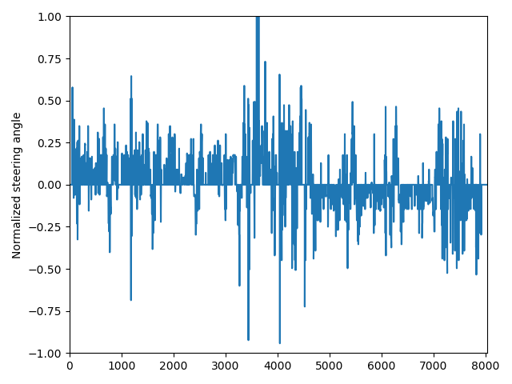
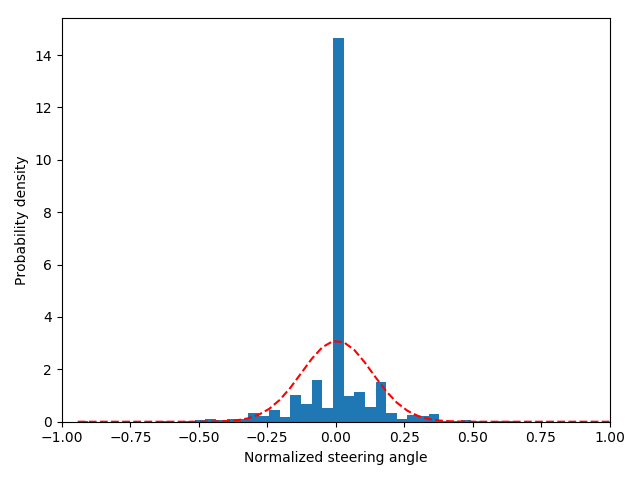

# Behavioral Cloning Project

## [Rubric points](https://review.udacity.com/#!/rubrics/432/view)

### Required files

#### Are all required files submitted?

> The submission includes a model.py file, drive.py, model.h5 a writeup report and video.mp4.

This submission includes the following files:

* [model.py](model.py);
* [drive.py](drive.py);
* [model.h5](model.h5);
* [README.md](README.md);
* [video.mp4](video.mp4).

### Quality of Code

#### Is the code functional?

> The model provided can be used to successfully operate the simulation.

Using the provided [simulator](https://github.com/udacity/self-driving-car-sim) and the files included in this repo ([drive.py](drive.py) & [model.h5](model.h5)), the car can be driven autonomously around the first track (lake track) by executing:

`python drive.py model.h5`

#### Is the code usable and readable?

> The code in model.py uses a Python generator, if needed, to generate data for training rather than storing the training data in memory. The model.py code is clearly organized and comments are included where needed.

The module [model.py](model.py) takes a path for the `driving_log.csv` file as single argument. It opens and parses that file to create a dataset structure that is fed to the `augment_data` method.
 
The `create_generator` returns a [generator](https://wiki.python.org/moin/Generators) and is reused for both training and validation datasets, reducing memory usage during the training.

### Model Architecture and Training Strategy

#### Has an appropriate model architecture been employed for the task?

> The neural network uses convolution layers with appropriate filter sizes. Layers exist to introduce nonlinearity into the model. The data is normalized in the model.

This model was inspired by the one described by [Firner et. al. from NVIDIA](https://devblogs.nvidia.com/parallelforall/deep-learning-self-driving-cars/):

However, some changes were required in order to adapt it to the given dataset:

* The first layer, `cropping_2d_input_1`, expects a **3@160x320** image and crops it to **3@90x320**;
* The forth convolution layer, `convolution_2d_4`, employs a *2x2 stride*, to produce an output (**64@3x18**) close to the original model (**64@3x20**);
* There are 5 fully connected layers, empirically chosen;
* The last connected layer, `dense_5`, output has a single class (instead of 10): **normalized steering angle**;
* The original paper, doesn't mention what activation functions were applied after each layer. I found that `ELU` provided better results than `ReLU` and applied it to every layer, but the last one.

Here is final model:

#### Has an attempt been made to reduce overfitting of the model?

> Train/validation/test splits have been used, and the model uses dropout layers or other methods to reduce overfitting.

The augmented dataset was split into 80% for training and 20% for validation. One dropout layer, `dropout_1` with **0.5** ratio was added between the convolution and fully connected layers. That was sufficient to prevent overfitting, since the validation loss was consistently lower than the training loss: 

#### Have the model parameters been tuned appropriately?

> Learning rate parameters are chosen with explanation, or an Adam optimizer is used.

Following over 40 iterations, the hyper-parameters where set to:

* Batch size: 128;
  * Didn't observe much difference between 32, 64 and 128. Since a generator was used, I chose the higher value to speed up the process;
* Number of epochs: 10;
  * The previous chart, suggested the losses could be even lower beyond 10 epochs, before overfitting. But the increasing costs with AWS, forced me to settle with 0.0113 for training loss and 0.0083 for validation loss;
* Learning rate: 0.0001;
  * Supplied to an Adam optimizer, instead of the default 0.001. Besides increasing the time to run each epoch to over 5 minutes, this provided the best result with the lower loss rates.

#### Is the training data chosen appropriately?

> Training data has been chosen to induce the desired behavior in the simulation (i.e. keeping the car on the track).

##### Data collection

The first time I tried the simulator, I was using the keyboard to steer the car and it felt there were only 3 discrete values for steering angle: -25°, 0° and 25°... Since the quality of the data is crucial for any DL project, I had to beg my wife permission to buy a [racing wheel](http://www.thrustmaster.com/en_US/products/t150-force-feedback). She agreed, since it was for *educational purposes*.

Of course, the racing wheel wasn't supported by the simulator, so I had to fork and change its [source code](https://github.com/rodfernandez/self-driving-car-sim/commit/20aba1c4dbd87b3f1e3e0402ec76238659a6c2e8). Yes, I had to learn a bit of Unity, brush my C#, setup the development environment, etc. Tell me about yak shaving...

After all of that, I recorded a [training dataset](https://github.com/rodfernandez/carnd-term1-behavioral-cloning-dataset
) consisting of:

* 3 laps in the lake track, counter-clockwise;
* 3 laps in the lake track, clockwise;
* 1 lap recovery lap in the lake track, counter-clockwise;
* 1 lap recovery lap in the lake track, counter-clockwise;
* 2 laps in the mountain track, counter-clockwise.

Right of the bat, training the model on CPU (MacBook Pro, Mid 2015, Intel Core i7 @ 2.5 GHz) in a single epoch without any data augmentation or pre-processing was sufficient to have the car driving itself around the lake track. The car also did fine for half-dozen corners on the mountain track. 

So, training it on GPU should be piece of cake. Not so fast... The AWS EC2 instance that used to work with the same configuration, would keep throwing me a `CUDA_ERROR_UNKNOWN` error. Googling the issue didn't help, but I learn on [Slack](https://carnd.slack.com/archives/C34N6MK39/p1490810970137680) that uninstalling and re-installing the NVIDIA drivers solves the issue.

Well, when I started training the model on GPU, with several epochs, I was able to achieve very low loss rates (>0.001), but I learned that was not a real indicator of real performance for autonomous driving. Under these conditions, I never managed to get a model capable of driving around the whole track. After dozens of iterations, my frustration was tremendous. I was about to drop it, when I found that some students were just using [Udacity's own dataset](https://d17h27t6h515a5.cloudfront.net/topher/2016/December/584f6edd_data/data.zip) in order to focus in getting the model and the training pipeline right with pretty good results. So, I decided to use it instead of my own...

##### Data analysis

The dataset had `8036` data points:

Here, we can see the actual distribution, please not there are a lot of data points where the steering angle is zero (or close to zero).

##### Data augumentation

We can augument the data not only to gather more data points, but also to re-shape the distribution. In this case, that means not including the samples where the steering angle was close to zero. The module `model.py` includes a constant `STEERING_ANGLE_THRESHOLD = 0.001` that is used by the `augment_data` in order to decide which samples should be included in the augmentation.

* `include_left`, `include_right`: if `True`, includes images from the left and right cameras with the steering angle adjusted by an offset (`STEERING_ANGLE_OFFSET = 0.25`).

* `include_flipped`: if `True`, includes the flipped image and negates the steering angle value. 

* `random_brightness`: if greater than zero, includes copies of the sample with brightness adjusted randomly in a interval of (-50%, 0). The initial interval was (-25%, 25%), but I found that reducing to 50% helped a lot with shadows on the track. The car tended to be pulled towards them and would usually go off the track.
 

* `random_contrast`: if greater than zero, includes copies of the sample with contrast adjusted randomly in a interval of (-50%, 50%). In the end, I decided to not use this feature, since it didn't helped improve the model performance.

After tweaking those parameters to augment the data, the distribution looked much better:

### Architecture and Training Documentation

#### Is the solution design documented?

> The README thoroughly discusses the approach taken for deriving and designing a model architecture fit for solving the given problem.

See: [*Model Architecture and Training Strategy*.](#model-architecture-and-training-strategy)

#### Is the model architecture documented?

> The README provides sufficient details of the characteristics and qualities of the architecture, such as the type of model used, the number of layers, the size of each layer. Visualizations emphasizing particular qualities of the architecture are encouraged.

See: [*Model Architecture and Training Strategy*.](#model-architecture-and-training-strategy)

#### Is the creation of the training dataset and training process documented?

> The README describes how the model was trained and what the characteristics of the dataset are. Information such as how the dataset was generated and examples of images from the dataset should be included.

See: [*Is the training data chosen appropriately?*](#is-the-training-data-chosen-appropriately)

### Simulation

#### Is the car able to navigate correctly on test data?

> No tire may leave the drivable portion of the track surface. The car may not pop up onto ledges or roll over any surfaces that would otherwise be considered unsafe (if humans were in the vehicle).

[video.mp4](video.mp4) has the recording of the autonomous driving around the lake track. We can see the car never leaves the track, but I believe performance could be better, since we still notice some oscillation on the wheel. Anyway, it also worked to speeds up to 15 mph, rather than the original 9 mph.

